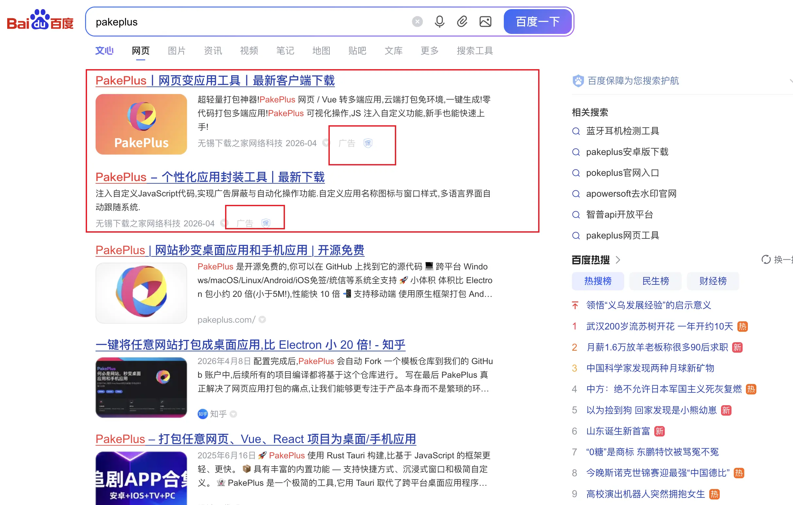
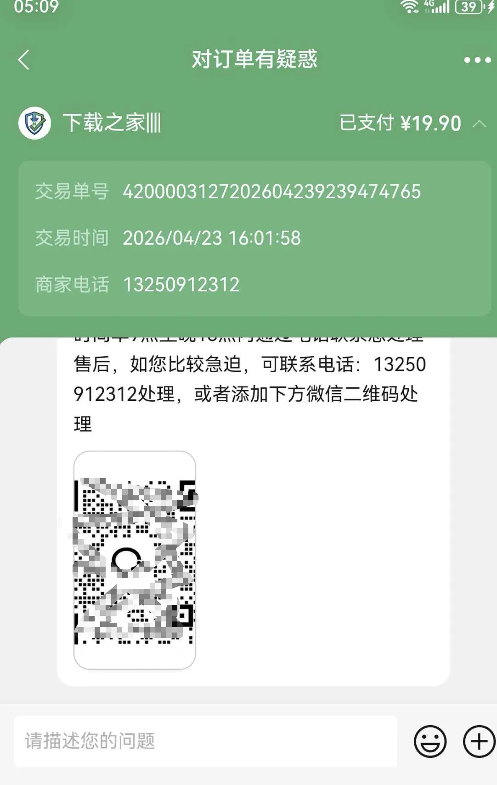
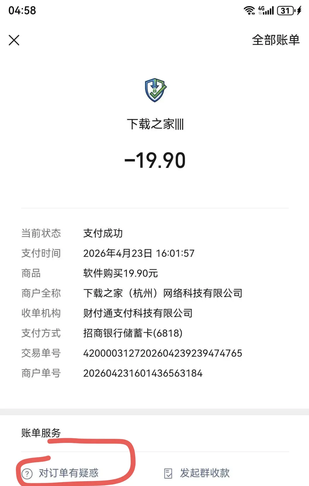
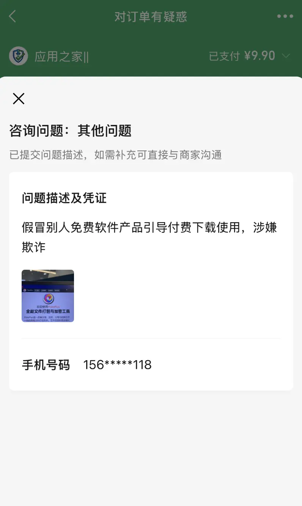
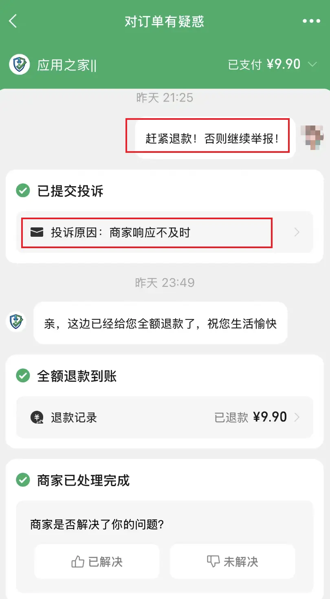

# 谨防诈骗

PakePlus 是开源免费项目，近期发现有人被百度搜索出来的广告诈骗，骗子软件伪装 PakePlus 官网，并提供下载链接，但是下载后发现安装 PakePlus 需要付费，有的用户不知道 PakePlus 是开源免费的，就导致被骗了。以后使用百度搜索一定要看清楚是不是广告，不然还会被骗！

## 骗子网站

骗子做了好几个网站，并且在百度进行投流，我们可以点击一下，就会消耗骗子的账户里面的钱，但是不要下载哦：

## 被骗付费

下载他们的软件后，如果要安装 PakePlus，就会弹窗让你付费，然后就会被骗：

因为被骗人数还在上升，这里就不放太多截图了。

## 投诉退款

被骗后一定要投诉退款！这是你的权益，骗子不敢不退，不然微信会直接封他的支付接口！
找到你的订单，然后点击：对订单有疑惑

然后点击投诉：

投诉内容就是：

假冒别人免费软件官网引导付费下载使用，涉嫌诈骗

如果它不理你，就一直投诉：

直到他退款为止，如果退款有任何问题，都可以加微信咨询：lanxingme 我一定会协助你完成申诉并退款！
